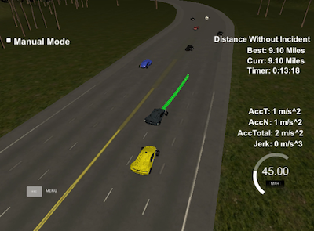

# Path Planning

#### Compilation
##### [The code](https://github.com/autohandle/CarNDPathPlanningProject/blob/master/src/main.cpp) compiles correctly.

``` shell
Softwares-MacBook-Pro:CarND-Path-Planning-Project david$ cd build
Softwares-MacBook-Pro:build david$ cmake .. && make
-- Configuring done
-- Generating done
-- Build files have been written to: /Users/david/Documents/UdacitysSelfDrivingCarProgram/lessons/term3/CarND-Path-Planning-Project/build
[100%] Built target path_planning
Softwares-MacBook-Pro:build david$ ./path_planning
argv_str:./path_planning
Listening to port 4567
^C
Softwares-MacBook-Pro:build david$
```

#### Valid Trajectories
##### The car is able to drive at least 4.32 miles without incident.



In the picture, you can see the car has gone more than 4.32 miles without incident and is in the process of changing lanes. A [short video](https://s3.amazonaws.com/autohandle.com/video/CarND-Path-Planning-Project.mp4) from which this still was extracted is shown below.

As currently programmed, the vehicle does not perform properly in all scenarios. I assume that I must stiil have coding errors.

The vehicle can get acceleration errors, especially if:
  * it is tracking one of the other cars that start and stop a lot
  * it gets cut off
  * it decides to change lanes when there is a sharp curve

Although rare, in my experience, the vehicle can collide with other cars when it changes lanes, especially if the other car is just slightly behind it and speeding up.

It can get confused and trigger a *out of lane* error if it is cut off during a lane change.

However, depending on the scenario the vehicle encounters, in my experience, the vehicle usually can eventually go 4 or 5 miles wthout incident required for the project.

##### The car drives according to the speed limit.
To insure the car stays under the speed limit, [the code](https://github.com/autohandle/CarNDPathPlanningProject/blob/185858841082cf7cd50254066f7de2d6fc3352e8/src/main.cpp#L1561)
sets the target velocity to 90% of the [maximum velocity](https://github.com/autohandle/CarNDPathPlanningProject/blob/185858841082cf7cd50254066f7de2d6fc3352e8/src/main.cpp#L287-L295).

``` C++
const double MAXIMUMMILESPERHOUR=50.;
const double MAXIMUMMETERSPERSECOND=milesPerHourToMetersPerSecond(MAXIMUMMILESPERHOUR);
double targetVelocity=.90*MAXIMUMMETERSPERSECOND;
```

###### Max Acceleration and Jerk are not Exceeded.

To keep the car under the acceleration limit, [the code](https://github.com/autohandle/CarNDPathPlanningProject/blob/185858841082cf7cd50254066f7de2d6fc3352e8/src/main.cpp#L1561)
set the target acceleration to 75% of the [maximum acceleration](https://github.com/autohandle/CarNDPathPlanningProject/blob/185858841082cf7cd50254066f7de2d6fc3352e8/src/main.cpp#L287-L295).

``` C++
const double MAXIMUMACCERLERATION=10.;// m/s^2
double targetAcceleration=0.75*MAXIMUMACCERLERATION;
```

Even after the target acceleration was reduced, the vehicle still exceeded the maximum acceleration both when changing lanes and when starting from a standing stop.

To reduce the lateral acceleration during a lane change, the path was smoothed by increasing the path planning distance [from 30 to 40 meters](https://github.com/autohandle/CarNDPathPlanningProject/blob/185858841082cf7cd50254066f7de2d6fc3352e8/src/main.cpp#L287-L295).

``` C++
const double PATHLOOKAHEADXDISTANCE=40.;// meters
const double PATHLOOKAHEADSDISTANCE=40.;// meters
```

To reduce the forward acceleration during a start from a standing stop, a [state variable](https://github.com/autohandle/CarNDPathPlanningProject/blob/185858841082cf7cd50254066f7de2d6fc3352e8/src/main.cpp#L1347) was created to distinguish lane changes and the initial start from other vehicle states.

``` C++
static bool stateTransition=true;

for (int additionalPoint=0; additionalPoint<addtionalCarPoints; additionalPoint++) {
  
  double deltaV=targetVelocity-pathPointVelocity; // m/s
  double signOfDeltaV = deltaV<0.?-1.:1.;
  double transitionAcceleration = targetAcceleration;
  
  if (stateTransition) {
    transitionAcceleration=isChangingLanes?transitionAcceleration:.5*transitionAcceleration;
  }

...

}
if (projectedPathVelocity > .9*targetVelocity) {
  stateTransition=false;
}
```

If a state transition was in progress, the [accelaration was reduced](https://github.com/autohandle/CarNDPathPlanningProject/blob/185858841082cf7cd50254066f7de2d6fc3352e8/src/main.cpp#L1699-L1704) by 50% and then the state transition was [cleared](https://github.com/autohandle/CarNDPathPlanningProject/blob/185858841082cf7cd50254066f7de2d6fc3352e8/src/main.cpp#L1745-L1747) when the vehicle reached 90% of the target acceleration.


###### Car does not have collisions.

###### Collisions during a lane change

The vehicle avoids collisions by [tracking the sensor parameters](https://github.com/autohandle/CarNDPathPlanningProject/blob/185858841082cf7cd50254066f7de2d6fc3352e8/src/main.cpp#L1206-L1243) of the other vehicles.

``` C++
static vector<vector<vector<double>>> sensedVehicles; // by car id, by rolling buffer size, by sensor id
static int SENSEDHISTORYLENGTH = 10; // approx seconds
```

[The code](https://github.com/autohandle/CarNDPathPlanningProject/blob/185858841082cf7cd50254066f7de2d6fc3352e8/src/main.cpp#L1464-L1476) tracks the current time

``` C++
const int movesCompleted=LENGTHOFCARPATHTRAJECTORY-previous_path_x.size();
const double timePassed = PATHPOINTDELTAT*movesCompleted;
currentT += timePassed;

```

and maintains a [rolling buffer](https://github.com/autohandle/CarNDPathPlanningProject/blob/185858841082cf7cd50254066f7de2d6fc3352e8/src/main.cpp#L1206-L1218) for each of the other vehicles

``` C++
static vector<vector<vector<double>>> sensedVehicles; // by car id, by rolling buffer size, by sensor id
static int SENSEDHISTORYLENGTH = 10; // approx seconds


const static void recordSensorReading(const vector<double> theSensed) {
  const int sensorId = getId(theSensed);
  vector<vector<double>>& sensedReadings=sensedVehicles[sensorId];
  if (sensedReadings.size() >= SENSEDHISTORYLENGTH) {// sensed buffer is full, remove oldest;
    sensedReadings.erase(sensedReadings.begin());
  }
  sensedReadings.push_back(theSensed);
}
```

after [attaching the current time](https://github.com/autohandle/CarNDPathPlanningProject/blob/185858841082cf7cd50254066f7de2d6fc3352e8/src/main.cpp#L1220-L1233) to the sensor reading.

``` C++
const static void recordSensorReading(vector<double> theSensed, const double theTime) {
  setT(theSensed, theTime);
  const int sensorId = getId(theSensed);
  const bool newlySensedVehicle = sensedVehicles.size()<(sensorId+1);// sensorId is index, so size must be at least id+1
  if (newlySensedVehicle) {
    sensedVehicles.resize(sensedVehicles.size()+20); // increase number of sensedVehicles by 100
  }
  setT(theSensed, theTime); // record sensor time
  recordSensorReading(theSensed);
}
```

With an *s distance* vesus *time* historical record of the the *sensor_fusion* for each of the other vehicles, [a spline can be fitted](https://github.com/autohandle/CarNDPathPlanningProject/blob/185858841082cf7cd50254066f7de2d6fc3352e8/src/main.cpp#L1252-L1273) to the historic *s* and *t* values to predict the *s position* of the other vehicle a future *time t*.

``` C++
const tk::spline createVehiclePath(const vector<double>& theSensedVehicle) {
  const int vehicleId = getId(theSensedVehicle);
  const vector<vector<double>> vehicleHistory = sensedVehicles[vehicleId];
  vector<double> tPoints;// x
  vector<double> sPoints;// y
  for (int history=0; history<vehicleHistory.size(); history++) {
    tPoints.push_back(getT(vehicleHistory[history]));
    sPoints.push_back(getS(vehicleHistory[history]));
  }
  tk::spline vehiclePath;
  vehiclePath.set_points(tPoints, sPoints);
  const double startingX=getT(vehicleHistory[0]);
  const double endingX=getT(vehicleHistory[vehicleHistory.size()-1]);
  const double deltaX=1.;
  return vehiclePath;
}
```

The vehicle can also [approximate its own path](https://github.com/autohandle/CarNDPathPlanningProject/blob/185858841082cf7cd50254066f7de2d6fc3352e8/src/main.cpp#L1275-L1293) and create a spline given its current position , `car_s`, and its current velocity, `car_speed`.

``` C++
const tk::spline createVehiclePath(const double sStart, const double sVelocity, double theStartTime, const double theEndTime, const double theDeltaTime) {
  vector<double> tPoints;// x
  vector<double> sPoints;// y
  double sVehicle=sStart;
  for (int time=theStartTime; time<theEndTime; time+=theDeltaTime) {
    tPoints.push_back(time);
    sPoints.push_back(sVehicle);
    sVehicle+=sVelocity*theDeltaTime;
  }
  tk::spline vehiclePath;
  vehiclePath.set_points(tPoints, sPoints);
  return vehiclePath;
}
```

The 2 splines [can be compared](https://github.com/autohandle/CarNDPathPlanningProject/blob/185858841082cf7cd50254066f7de2d6fc3352e8/src/main.cpp#L1295-L1308) at each point in time along the vehicle's projected path

``` C++
const bool pathsAreSeparated(const tk::spline& theFirstPath, const tk::spline& theSecondPath, const double thePathSeparation, const double theStartTime, const double theEndTime, const double theDeltaTime) {
  for (double time=theStartTime; time<theEndTime; time+=theDeltaTime ) {
    const double s1 = theFirstPath(time);
    const double s2 = theSecondPath(time);
    const bool isSeparated = abs(s2-s1)>abs(thePathSeparation);
    if (!isSeparated) {
      return false;
    }
  }
  return true;
}
```

to see if the gap between the two vehicles is large enough to prevent a collision durng a lane change.

###### Collisions with the car in front

The car in front is detected in each processing loop by [scanning all the cars in the same lane](https://github.com/autohandle/CarNDPathPlanningProject/blob/185858841082cf7cd50254066f7de2d6fc3352e8/src/main.cpp#L993-L1059) as the vehicle, `car_d`, and selecting the one that is the closest to, but larger than the car's current position, `car_s`.

``` C++
const vector<double> closestInLane = closestSensedInFront(car_d, car_s, sensor_fusion);
const bool isCarInFrontInLane = closestInLane.size()>0;
```

If there is `isCarInFrontInLane`, then [the code](https://github.com/autohandle/CarNDPathPlanningProject/blob/185858841082cf7cd50254066f7de2d6fc3352e8/src/main.cpp#L1577-L1668) checks to see if the that vehicle is inside the current planning horizon

``` C++
const double patLookaheadPlanningDistance=PATHLOOKAHEADSDISTANCE;
...
const double endDeltaT=PATHPOINTDELTAT*next_x_vals.size()/*number of previous points*/;// time in previous path = dt*N
const double endDeltaS = endDeltaT*getV(closestInLane);// dT*V=dS, distance traveled in dT
const double closestEndS = getS(closestInLane)+endDeltaS;// s+dS, position of closest car t the end of the previous path
const double closestDeltaS = closestEndS-end_path_s;// s to closest car at the end of the previous path (current planning cycle)
//const double deltaD = deltaS-patLookaheadPlanningDistance;// compare distance to closest & planning horizon
const bool insidePlanningHorizon = closestDeltaS<patLookaheadPlanningDistance;// compare distance to closest & planning horizon
 
 ```

 If the other vehicle is `insidePlanningHorizon`, then the vehicle's `targetVelocity` is adjusted to match the velocity of the other vehicle.

 ``` C++
 if (insidePlanningHorizon) {// adjust velocity
  const double deltaS = patLookaheadPlanningDistance-endDeltaS;// shortfall
  const double percent = deltaS/patLookaheadPlanningDistance;
  const double velocityFactor = 1.-max(0.,percent/* 0 to 1*/);// 1 to 0
  //const double deltaV = getV(closestInLane)-projectedPathVelocity;// speed difference
  targetVelocity = velocityFactor*getV(closestInLane);
  ...
}
```

In each processing loop the `targetVelocity` continues to be adjusted to match the vehicle in front.

###### The car stays in its lane, except for the time between changing lanes.


###### The car is able to change lanes

If the vehicle has detected that there is another vehicle in front of it,`isCarInFrontInLane`, and that vehicle is inside the planning horizon,`insidePlanningHorizon`, then [the code](https://github.com/autohandle/CarNDPathPlanningProject/blob/185858841082cf7cd50254066f7de2d6fc3352e8/src/main.cpp#L1598-L1617) seaches for a viable lane in which to switch.

``` C++
const vector<vector<double>> slowestSensedInFront = slowestInFrontInAnyLane(NUMBEROFLANES, car_s, sensor_fusion);
const vector<bool> fasterLanes = findFasterLane(determineLane(car_d), slowestSensedInFront);
const vector<bool> safeLanes=isLaneSafe(car_s, targetVelocity, 25./*size of vehicle*/, currentT, currentT+PATHLOOKAHEADSDISTANCE/PATHPOINTDELTAT, 60.*(50.*PATHPOINTDELTAT/* 1 second */) /* 1 minute */ , sensor_fusion);
const int safeLane=findFasterSafeLane(determineLane(car_d), safeLanes, fasterLanes);
```

First [the code](https://github.com/autohandle/CarNDPathPlanningProject/blob/185858841082cf7cd50254066f7de2d6fc3352e8/src/main.cpp#L1007-L1101) finds the slowest vehicle in each lane,`slowestInFrontInAnyLane`.

``` C++
const static vector<vector<double>> slowestInFrontInAnyLane(const int theNumberOfLanes, const double theS, const vector<vector<double>> theSensed) {
  vector<vector<double>> slowestInLane;
  slowestInLane.resize(theNumberOfLanes);
  for (int lane=0; lane<theNumberOfLanes; lane++) {
    slowestInLane[lane] = slowestSensedInFront(lane, theS, theSensed);
  }
  return slowestInLane;
}
```

Then each lane is [checked](https://github.com/autohandle/CarNDPathPlanningProject/blob/185858841082cf7cd50254066f7de2d6fc3352e8/src/main.cpp#L1136-L1159) by `findFasterLane` searching for a better lane choice.

``` C++
const vector<bool> findFasterLane(const int theCurrentLane, const vector<vector<double>> theSensedSlowest) {
  const double SPEEDFACTORTOBEFASTER=1.2;
  const double benchmarkSpeed = getV(theSensedSlowest[theCurrentLane]);
  vector<bool> fasterLane(theSensedSlowest.size(), false);
  fasterLane.resize(theSensedSlowest.size());
  for (int lane=0; lane<theSensedSlowest.size(); lane++) {
    const bool isCurrentLane = (lane==theCurrentLane);
    if (!isCurrentLane) {
      const bool isEmptyLane = theSensedSlowest[lane].size()==0;
      if (isEmptyLane) {
        fasterLane[lane] = true;
      } else {// if it is not empty, is it better than the benchmark (.i.e. the current lane)
        const bool isBetterThanBenchmark = getV(theSensedSlowest[lane]) > (SPEEDFACTORTOBEFASTER*benchmarkSpeed);
        if (isBetterThanBenchmark) {
          fasterLane[lane]=true;
        }
      }
    }
  }
  if (DEBUGVEHICLEPATH) {
    cout << "findFasterLane-fasterLane:" << toString(fasterLane) << std::endl;
  }
  return fasterLane;
}
```

A lane is selected if
  * that lane has nothing in front of the driven vehicle or
  * if the lane does have vehicles, then all of the vehicles in that lane are going at least 20% faster.

Then the `fasterLanes` are [checked for safety](https://github.com/autohandle/CarNDPathPlanningProject/blob/185858841082cf7cd50254066f7de2d6fc3352e8/src/main.cpp#L1328-L1338). As discussed in collision, `isLaneSafe` compares the spline path of the other vehicles, in that lane, with the spline path of the driven vehicle. If the spline paths are too close, that lane is ignored.

``` C++
const vector<bool> isLaneSafe(const double theVehicleS, const double theVehicleSVelocity, const double theVehicleSize, const double theStartTime, const double theEndTime, const double theDeltaTime, const vector<vector<double>> theSensed) {
  vector<bool> isSafe(3,false);
  const tk::spline vehiclePath = createVehiclePath(theVehicleS, theVehicleSVelocity, theStartTime, theEndTime, theDeltaTime);
  for (int lane=0; lane<2; lane++) {
    isSafe[lane]=isLaneSafe(lane, vehiclePath, theVehicleSize, theStartTime, theEndTime, theDeltaTime, theSensed);
  }
  return isSafe;
}
```

If the lane is [both safe and faster](https://github.com/autohandle/CarNDPathPlanningProject/blob/185858841082cf7cd50254066f7de2d6fc3352e8/src/main.cpp#L1605-L1617), the vehicle will transition to a safe and faster lane.

```C++
if (CANCHANGELANES && safeLane>=0) {
  targetLane=safeLane;
  isChangingLanes=true;
  stateTransition=true;
} else {// inside the planning & not changing lanes, track vehicle in front
  targetVelocity=getV(closestInLane);// track vehicle in front, unless i'm changing lanes
  }
}
```

If there is no safe and faster lane, the vehicle continues to the track the vehicle in front of it.

##### Reflection
###### There is a reflection on how to generate paths.

A had a lot of difficulty generating paths for this assignments. The difficulty was compounded by the profound disconnect between the class presentation and the suggested implementation. Even so, several things it would have helped me:
  * a implementation for the calculation of acceleration and jerk errors, so i could figure out exactly what was wrong
  * *unit test* scenarios that could be read from a file, so i could repeatedly work on problem areas, before using the randomized simulator

#### Video

The video of the car after going "4.32 miles without incident" and showing "the car is able to change lanes":

[path video](https://s3.amazonaws.com/autohandle.com/video/CarND-Path-Planning-Project.mp4)


The video was created by using a [screen recording tool](http://www.idownloadblog.com/2016/02/26/how-to-record-part-of-mac-screen-quicktime/).

