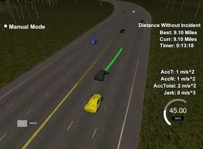

# Path Planning

#### Compilation
##### The code compiles correctly.

``` shell
Softwares-MacBook-Pro:CarND-Path-Planning-Project david$ cd build
Softwares-MacBook-Pro:build david$ cmake .. && make
-- Configuring done
-- Generating done
-- Build files have been written to: /Users/david/Documents/UdacitysSelfDrivingCarProgram/lessons/term3/CarND-Path-Planning-Project/build
[100%] Built target path_planning
Softwares-MacBook-Pro:build david$ ./path_planning
argv_str:./path_planning
Listening to port 4567
^C
Softwares-MacBook-Pro:build david$
```

#### Valid Trajectories
##### The car is able to drive at least 4.32 miles without incident.


##### The car drives according to the speed limit.


###### Max Acceleration and Jerk are not Exceeded.

[The constraints](https://github.com/autohandle/CarNDMPCProject/blob/def705e76b0e3c370ba75dac1220d152f887586b/src/MPC.cpp#L144-L214) consist of 3 parts: [the equations of motion](https://github.com/autohandle/CarNDMPCProject/blob/def705e76b0e3c370ba75dac1220d152f887586b/src/MPC.cpp#L163-L213),
``` C++
AD<double> x1 = vars[x_start + t];

AD<double> x0 = vars[x_start + t - 1];
AD<double> psi0 = vars[psi_start + t - 1];
AD<double> v0 = vars[v_start + t - 1];

fg[1 + x_start + t] = x1 - (x0 + v0 * CppAD::cos(psi0) * dt);

```


###### Car does not have collisions.

[The Costs](https://github.com/autohandle/CarNDMPCProject/blob/def705e76b0e3c370ba75dac1220d152f887586b/src/MPC.cpp#L88-L138) to be minimized consist of:

the desired cross track error,


###### The car stays in its lane, except for the time between changing lanes.

There are two actuators: the steering angle, `delta`, and the acceleration, `a`. The actuators appear in:


###### The car is able to change lanes

The initial value of both the minimized state variables and actuators are collected into a vector:


##### Reflection
###### There is a reflection on how to generate paths.


#### Video

The video of the car after going "4.32 miles without incident" and showing "the car is able to change lanes":

[third order polynomial](https://s3.amazonaws.com/autohandle.com/video/CarND-Path-Planning-Project.mp4)


The video was created by using a [screen recording tool](http://www.idownloadblog.com/2016/02/26/how-to-record-part-of-mac-screen-quicktime/).

